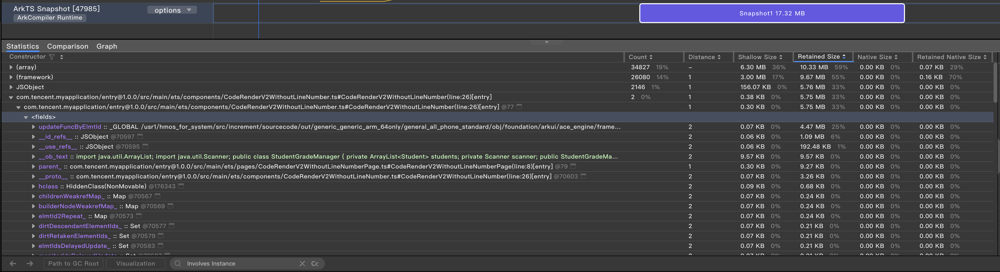
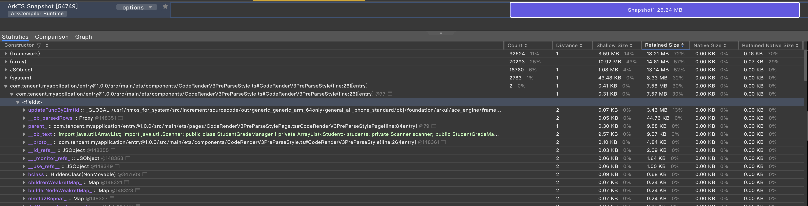
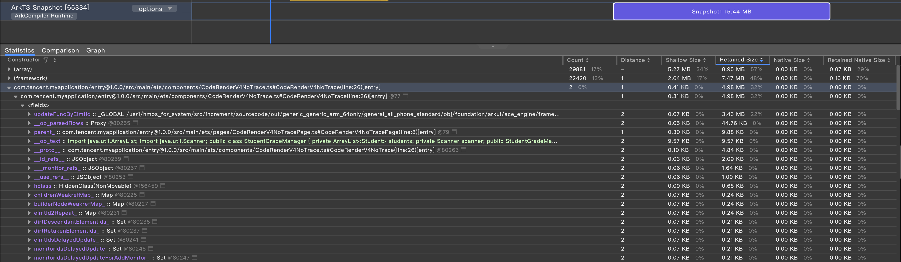

本仓库demo基于 https://gitee.com/luvi/lv-markdown-in 形成，不涉密。

* CodeRenderV2WithoutLineNumber.ets: ui层解析代码块 (5750KB)
  
* CodeRenderV3PreParseStyle.ets: 前置预解析代码块 ObservedV2+Trace （占用7580KB，但是看不出来哪里占用的）
  
* CodeRenderV4NoTrace.ets: 前置预解析代码块 无Trace （4980KB）
  

发现 CodeRenderV3PreParseStyle 的内存占用达到了7MB+，远高于CodeRenderV2WithoutLineNumber、CodeRenderV4NoTrace。

内存文件在 docs 文件夹下，dump出来后，大头 updateFuncByElmtId 只占用3MB。解释不通。